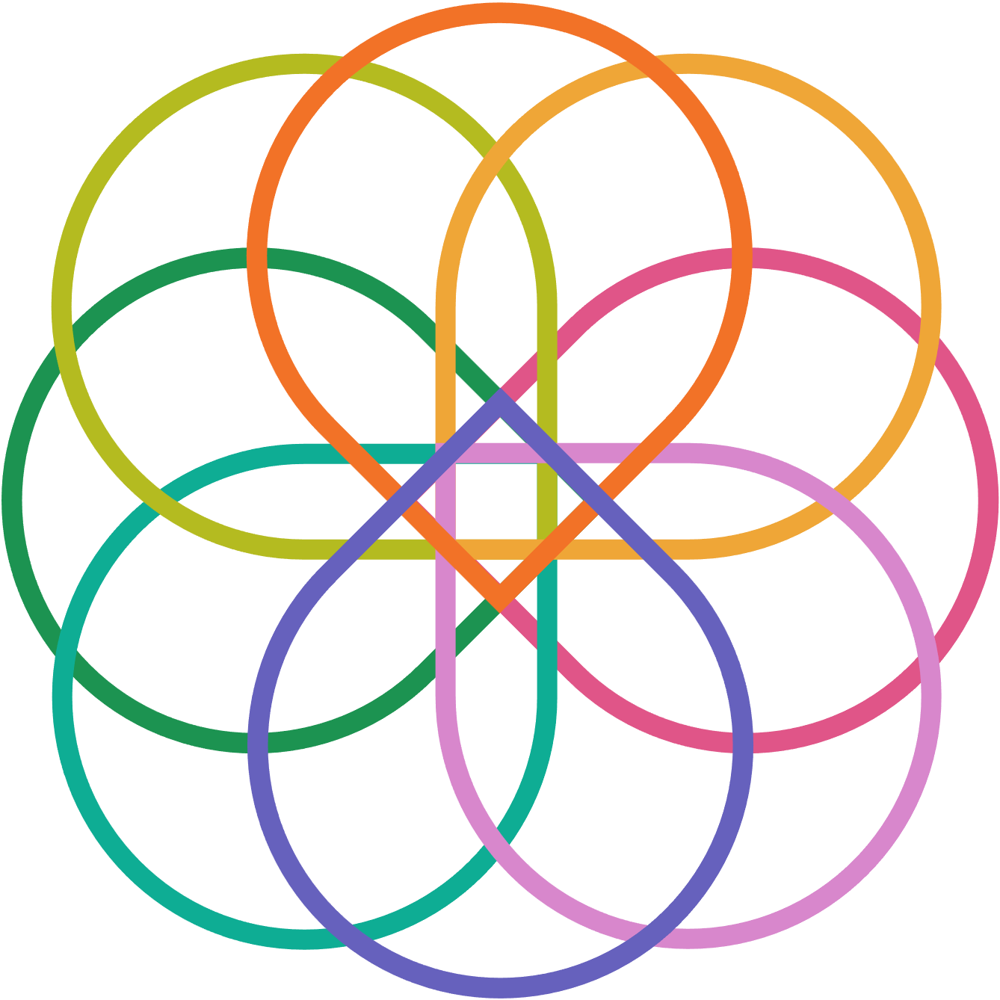

# The SRE Knot

## The Symbol of Site Reliability Engineering

* 8 teardrops orbiting the same gravity center representing each statement in the SRE manifesto
* 1 central square representing the overall reliability goal
* Multiple colors to represent the technology ecosystem variety
* Brand usage: the image and icon below can be used for **personal** and **commercial** purposes. They can be used on your website, branding, and designs to showcase support for the SRE Manifesto. In all cases, this site must be mentioned as the original proprietary of the art.

## End
