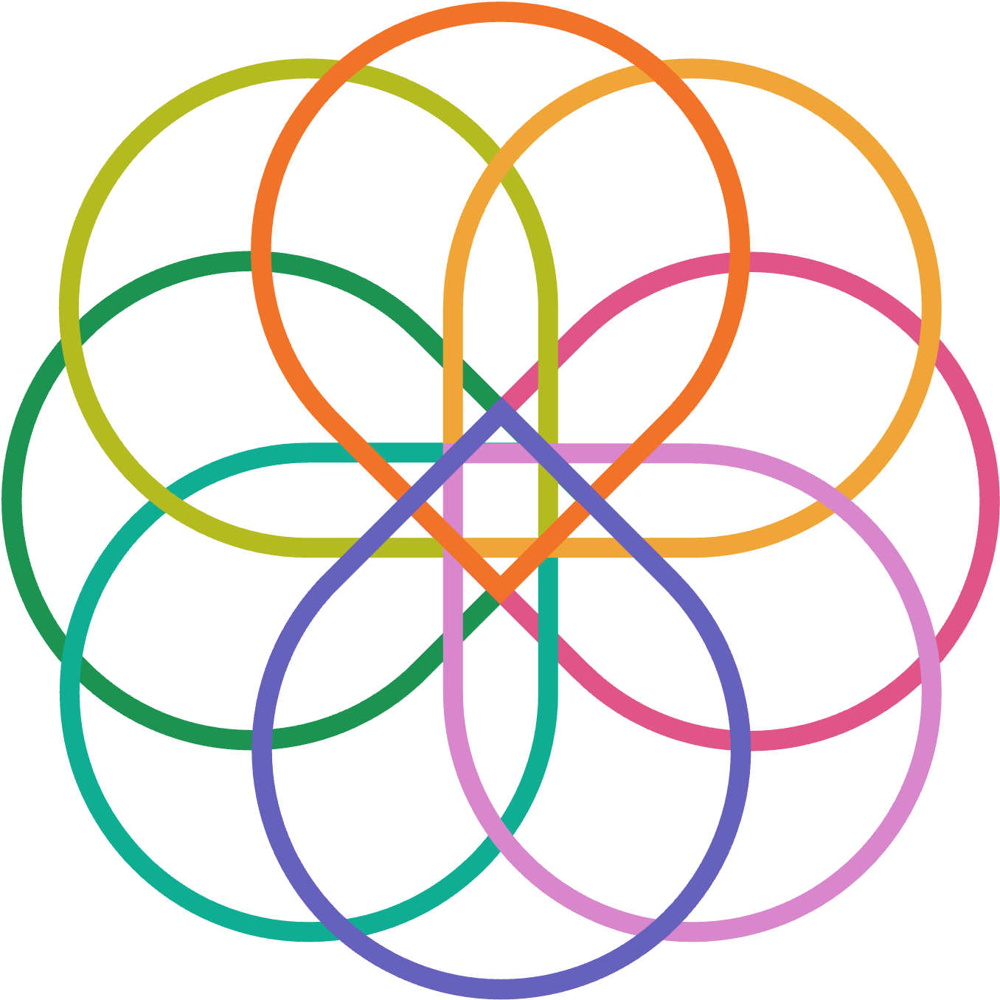

# The SRE Knot

## The Symbol of Site Reliability Engineering

### Symbology

* Eight (8) teardrops orbiting the same gravity center representing each statement in the SRE manifesto
* Eight (8) colors and cardinal directions, one per teardrop, to represent the technology ecosystem multiplicity
* One (1) central square representing the overall reliability goal

| **Direction** | **Color Name** | **HEX code** |
|:-------------|:----------|:-------:|
| North | Pumpkin Orange | #F17222 |
| Northeast | Fuel Yellow | #F0A834 |
| East| Dark Pink | #E5558B |
| Southeast | Lavender Pink | #D887CC |
| South | Iris | #6661BE |
| Southwest | Green Blue | #05AF95 |
| West | Eucalyptus | #159450 |
| Northwest | Pea | #B4BB1A |
| | | |

### Brand Usage

* The image and icon below can be used for **personal** and **commercial** purposes. They can be used on your website, branding, and designs to showcase support for the SRE Manifesto. In all cases, this site must be mentioned as the original proprietary of the art.

### Assets Download

* [Image](https://raw.githubusercontent.com/rod4n4m1/sre-manifesto/refs/heads/main/docs/images/sre-knot.png)
* [Icon](https://raw.githubusercontent.com/rod4n4m1/sre-manifesto/refs/heads/main/docs/images/sre-knot.ico)

## End
