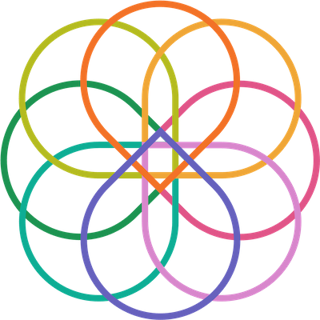

# The SRE Knot

## The Symbol of Site Reliability Engineering

* 8 teardrops orbiting the same gravity center representing each statement in the SRE manifesto
* 1 central square representing the overall reliability goal
* Multiple colors to represent the technology ecosystem variety

## End
